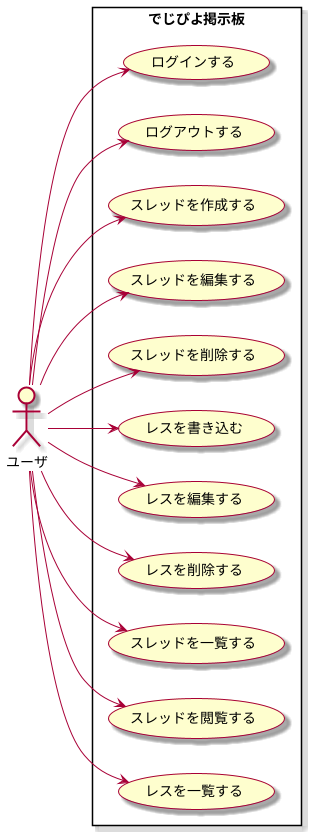
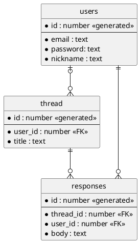

# Laravel SanctumとNext.jsの勉強

## Requirement
- PHP > 8.1
- Node > 18.6

## Installation
```sh
$ git clone git@github.com:kkznch/learn-laravel-sanctum.git
$ cd lean-laravel-sanctum
```

Laravel
```sh
$ cd backend
$ composer install
$ cp .env.example .env
$ php artisan key:generate
$ cd ..
```

Next.js
```sh
$ cd frontend 
$ yarn install
$ cp .env.example .env
$ cd ..
```

## Usage
Laravelを起動する。
```sh
$ (cd backend && php artisan serve)
```

Next.jsを起動する。
```sh
$ (cd frontend && yarn run dev)
```

## 設計
### ユースケース図


### ER図

